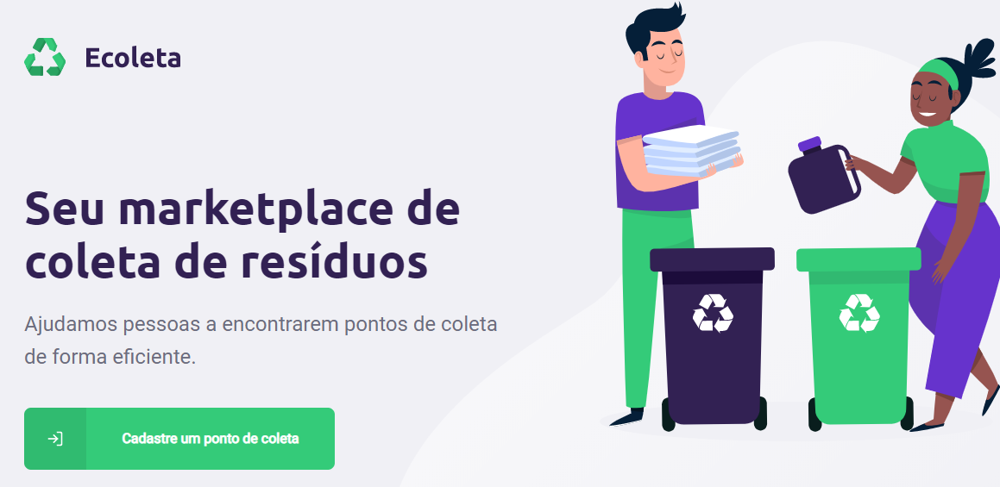

 

# Ecoleta

Projeto que esta sendo desenvolvido na semana Next Level Week da RocketSeat. O mesmo tem por objetivo cadastrar pontos de coletas de reciclagem.

# Arquitetura

A arquitetura desenvolvida durante a semana não foi implementa por completo o conceito de MVC, mas foi separado a camada de abstração de Controllers e Rotas como forma de melhor organizar o código

# Bibliotesca utilizadas

* React Js
* React Native Js
* Node Js
* Leafletjs
* React-leaflet
* Celebrate

# Banco de Dados

* SQLITE3
* KnexJS - Query Builder

# Api Externas Utilizadas

* API IBGE - UF e Municipios
https://servicodados.ibge.gov.br/api/docs/localidades?versao=1

